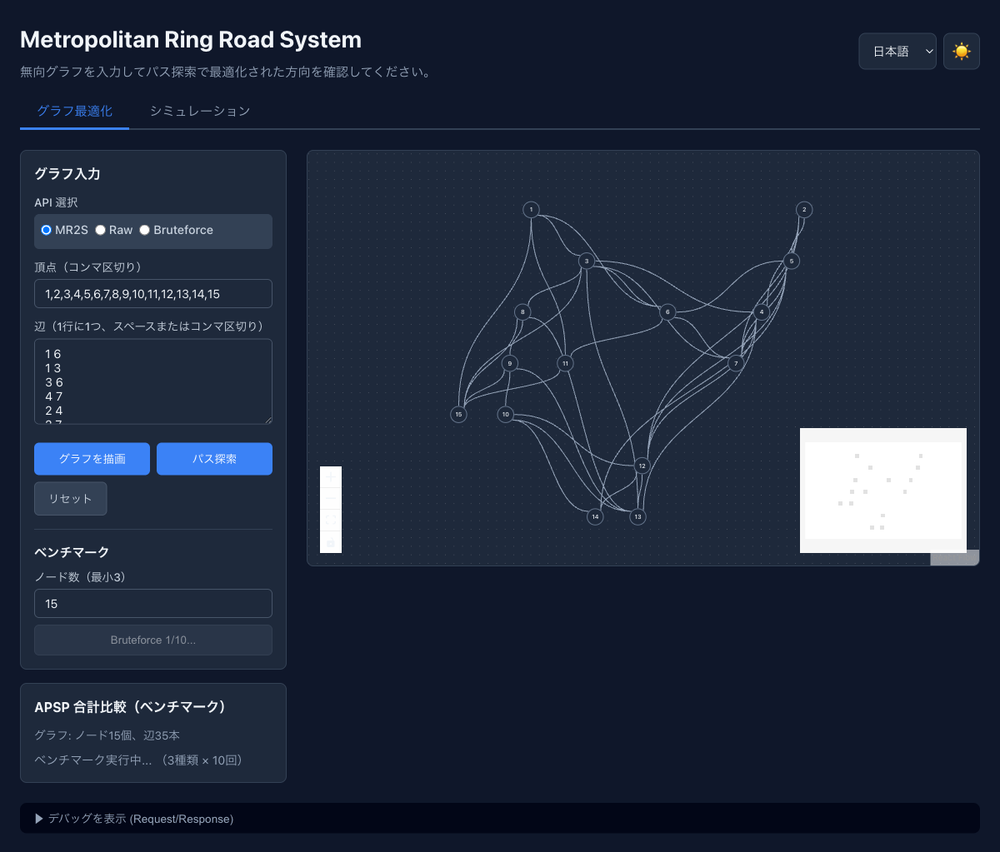
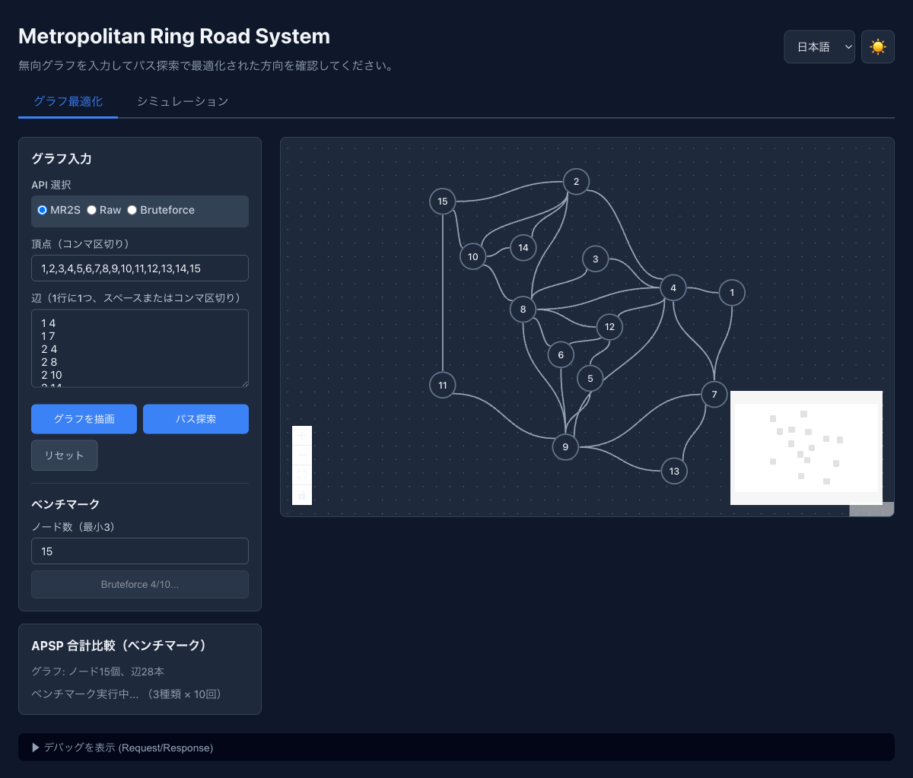
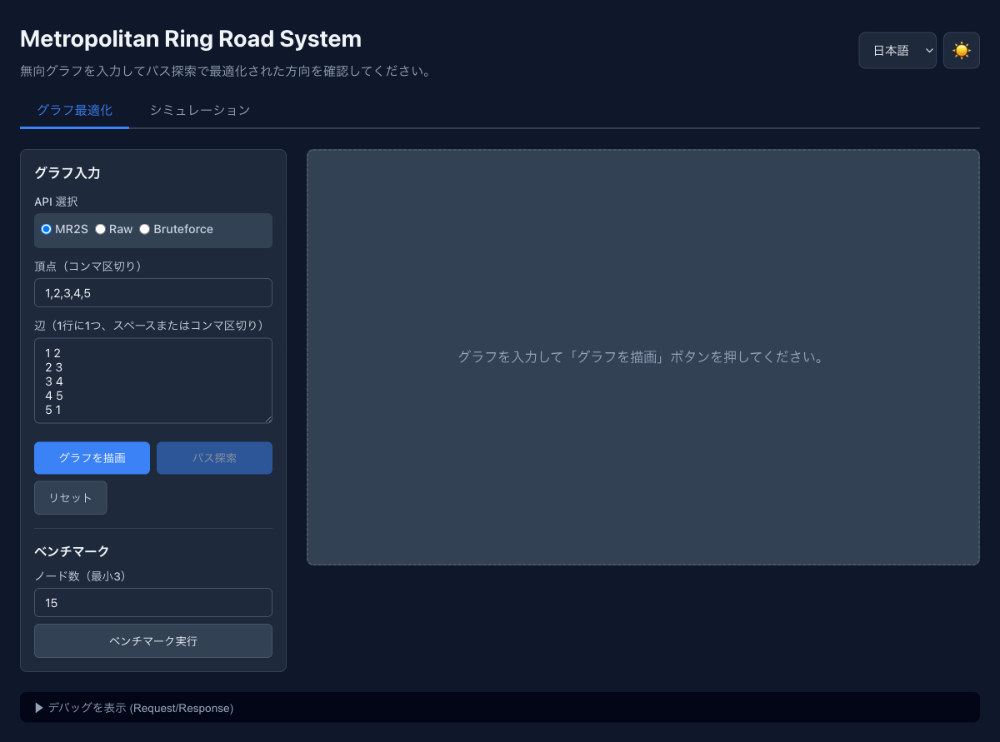
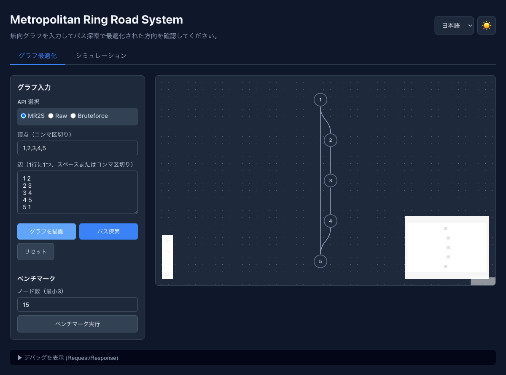
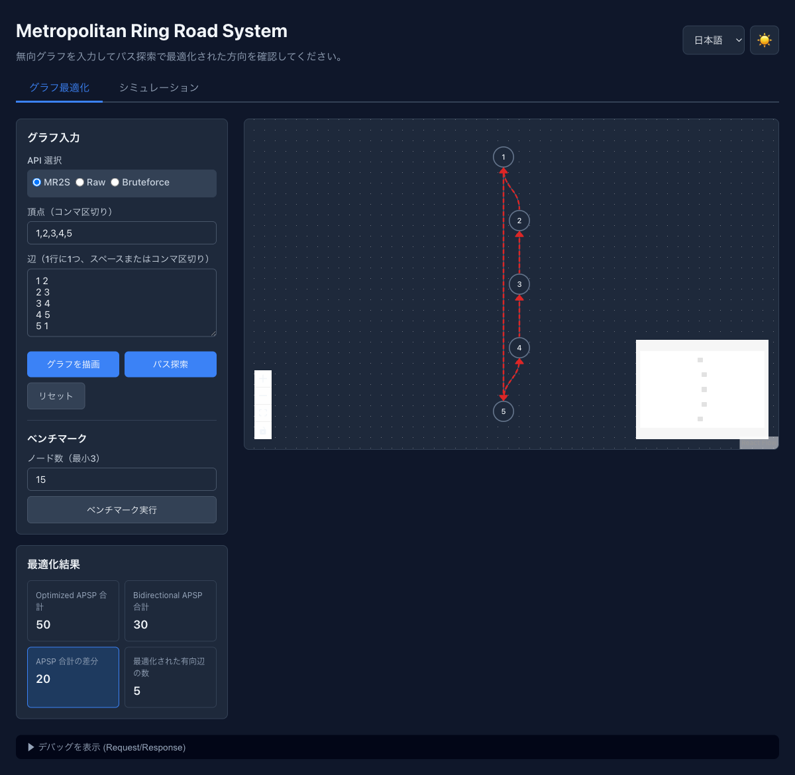
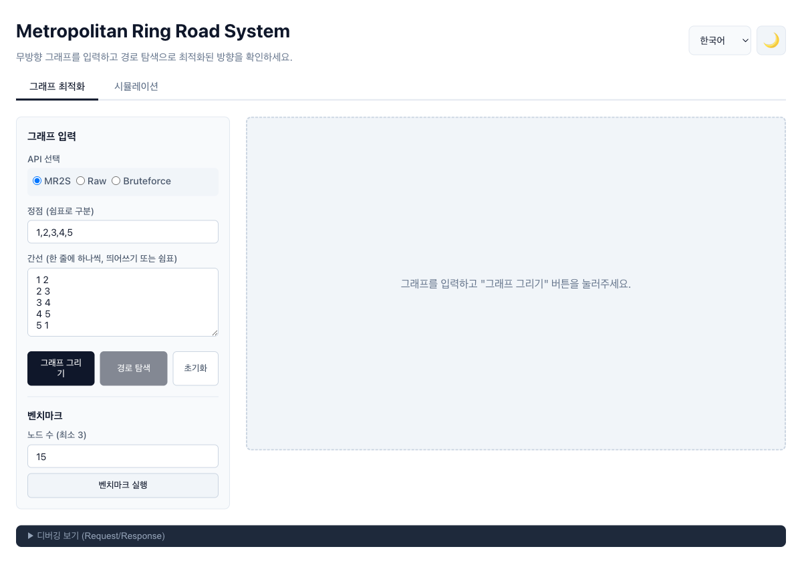
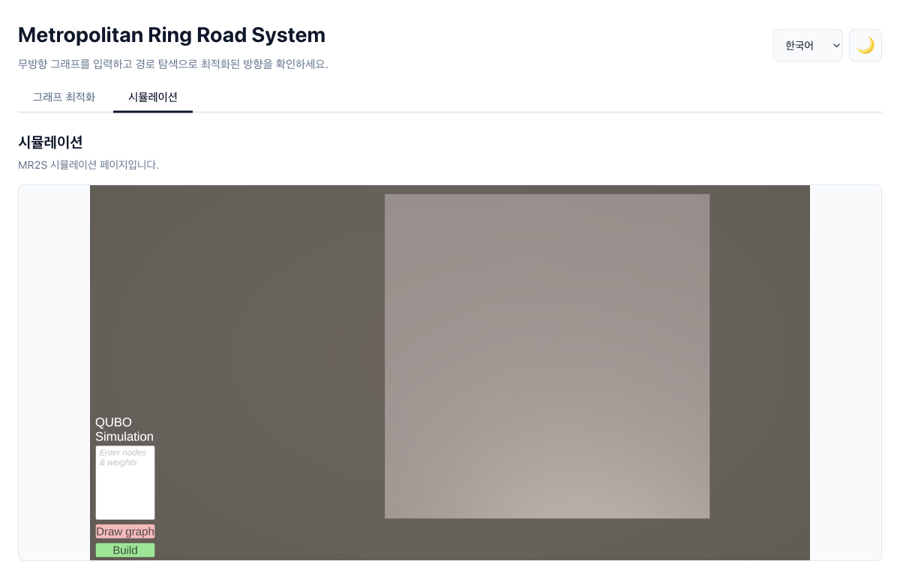

# mr2s-frontend 統合 ワークフロースクリーンショット

## Before vs After 比較

### Before: Delaunay + Dagre（既存、バックエンド未接続時）

| # | スクリーンショット | 説明 |
|---|---|---|
| 01 |  | 初期画面（ダークモード・日本語） |
| 02 |  | ベンチマーク実行後のグラフ。**Delaunay 三角分割** (35辺=最大密度) + **Dagre 階層レイアウト**。辺の交差が多く見づらい。 |

### After: 改善版バックエンド（力学レイアウト + 辺数制御）

| # | スクリーンショット | 説明 |
|---|---|---|
| 03 |  | ベンチマーク実行後のグラフ。**バックエンド生成** (28辺=65-75%密度) + **力学レイアウト**（F-R + KK stress）。辺が分散し見やすい。 |
| 04 |  | ベンチマーク進行中（MR2S/Raw SA/Bruteforce 各10回）。 |

### Before vs After 主要な違い

| 項目 | Before | After |
|---|---|---|
| グラフ生成 | Delaunay 三角分割（フロントエンド） | Python バックエンド API |
| 辺数 | 常に最大 (3n-6 = 35辺) | 制御可能 (65-75%密度 = 28辺) |
| レイアウト | Dagre 階層化 | F-R + KK stress 力学モデル |
| 交差 | 多い | 少ない（ノード位置では交差なし） |
| 最小次数 | 保証なし | 2以上保証 |
| 橋 | あり得る | なし保証 |

---

## 手動入力フロー（前後で変更なし）

手動で頂点・辺を入力する場合は Dagre レイアウトをフォールバックとして使用。

| # | スクリーンショット | 操作 | 説明 |
|---|---|---|---|
| 05 |  | 初期状態 | 頂点 1,2,3,4,5 / 辺 1-2,2-3,3-4,4-5,5-1 が入力済み |
| 06 |  | 「グラフを描画」押下 | Dagre レイアウトで C5 グラフを描画 |
| 07 |  | 「パス探索」押下 | MR2S API で最適化、赤い有向矢印が表示。最適化結果パネルも表示（Optimized APSP: 50, Bidirectional: 30） |
| 08 |  | 「リセット」押下 | グラフ消去、初期状態に戻る |

---

## その他の機能

| # | スクリーンショット | 操作 | 説明 |
|---|---|---|---|
| 09 |  | 韓国語 + ライトモード | 言語セレクタで韓国語、テーマトグルでライトモードに切替。全ラベル・ボタンが切替。 |
| 10 |  | シミュレーションタブ | Unity WebGL ベースの MR2S シミュレーション（外部 iframe）。QUBO Simulation の入力欄あり。 |

---

## 操作フローまとめ

```
┌─────────────┐     ┌─────────────┐     ┌─────────────┐
│  初期画面    │ ──→ │ グラフ描画   │ ──→ │ 最適化結果   │
│  (05)       │     │  (06)       │     │  (07)       │
└─────────────┘     └──────┬──────┘     └──────┬──────┘
       │                   │                    │
       │            「リセット」 ←─────────────┘
       │              (08)
       │
       ├── ベンチマーク実行 ──→  グラフ生成 (03/04)
       │   (バックエンド ON → 改善版)     ↓
       │   (バックエンド OFF → Delaunay 02)  ベンチマーク結果
       │
       ├── 言語切替 (09)
       ├── テーマ切替 (09)
       └── シミュレーション (10)
```

## 変更によるUI影響

**影響なし**: ボタン配置、フォーム、結果パネル、デバッグパネル、言語切替、テーマ、シミュレーションタブ — すべて既存のまま。

**変わるのはグラフの見た目のみ**: ベンチマーク実行時のランダムグラフ生成がバックエンド経由になり、レイアウトが力学モデルに変わる。手動入力時は従来通り Dagre。
